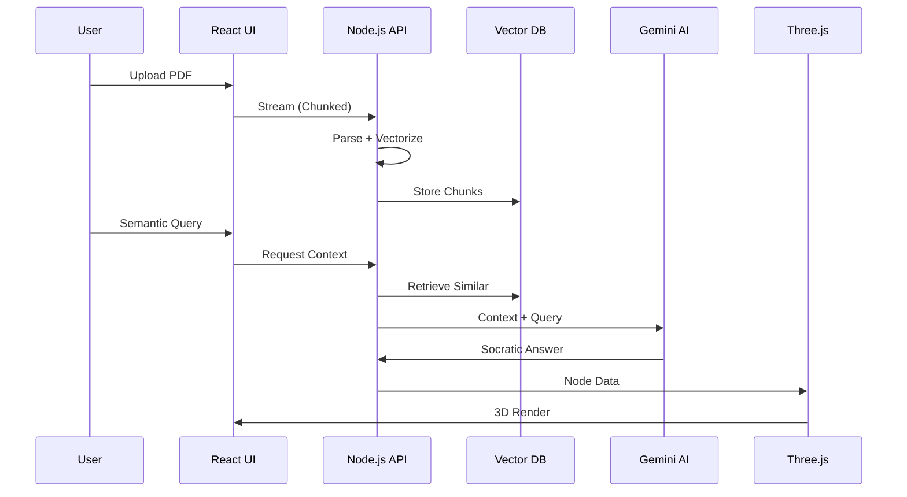
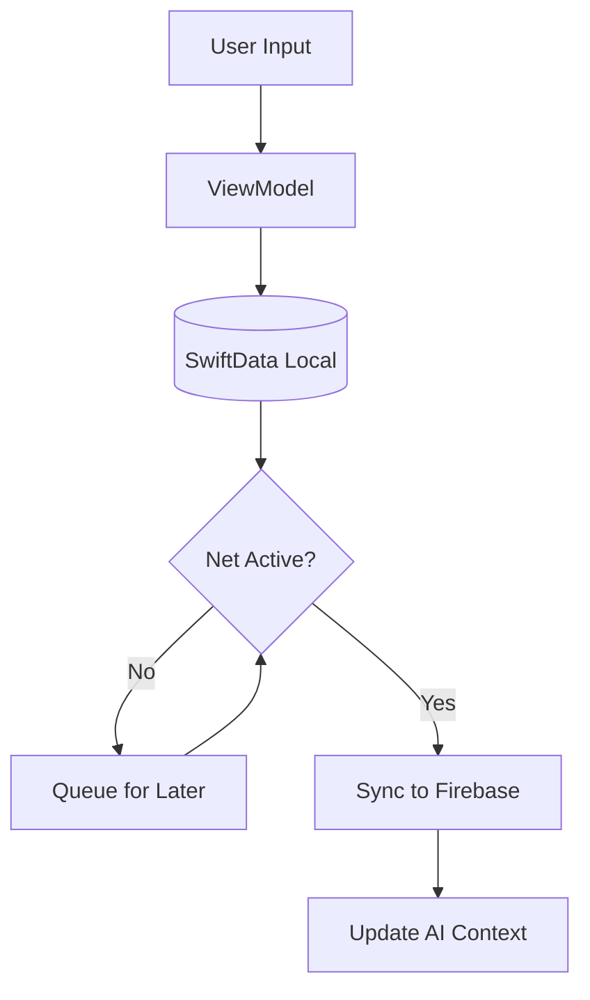
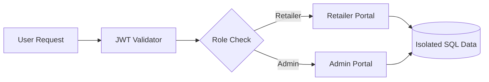
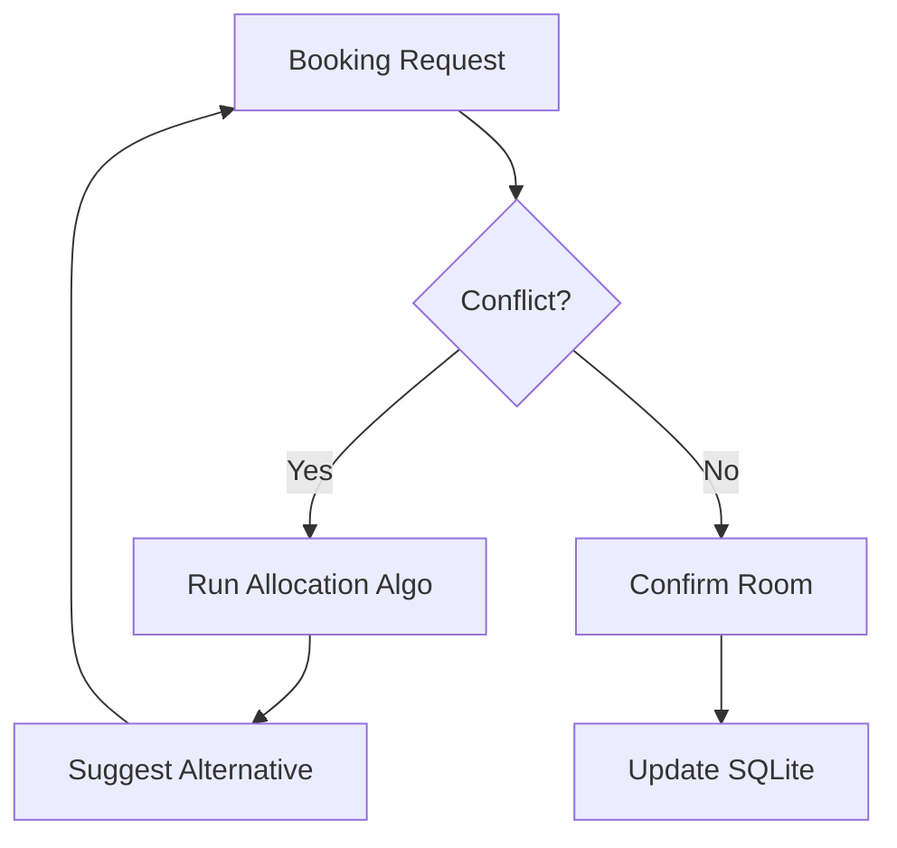

<!-- ═══════════════════════════════════════════════════════════════════ -->
<!-- CYBER-NEURAL INTERFACE: SYSTEM BOOT SEQUENCE -->
<!-- ═══════════════════════════════════════════════════════════════════ -->
<div align="center">

<!-- ATMOSPHERIC HEADER -->


<!-- DYNAMIC TYPING TERMINAL -->
<a href="https://github.com/hareeshkar">

</a>

</div>

<!-- ANIMATED DIVIDER -->


<!-- ═══════════════════════════════════════════════════════════════════ -->
<!-- IDENTITY MATRIX: AGENT PROFILE (MACOS TERMINAL STYLE) -->
<!-- ═══════════════════════════════════════════════════════════════════ -->
<div align="center">
<table width="95%" style="border: none;">
<tr>
<td width="35%" valign="top" align="center" style="border: none;">
<br/>

<br/><br/>

<br/><br/>
<a href="https://hareeshkar.github.io/portfolio/">

</a>
<a href="https://linkedin.com/in/hareeshkar">

</a>
<br/>
<a href="mailto:hareeshkarravi@gmail.com">

</a>
<a href="tel:+94771737524">

</a>
</td>
<td width="65%" valign="top" style="border: none;">
<br/>
<!-- MacOS Terminal Wrapper -->
<div style="background: #0d1117; border: 1px solid #30363d; border-radius: 12px; overflow: hidden; box-shadow: 0 10px 30px rgba(0,0,0,0.5); text-align: left;">
  <div style="background: #161b22; padding: 10px 15px; display: flex; gap: 8px; border-bottom: 1px solid #30363d;">
    <span style="width: 12px; height: 12px; background: #ff5f56; border-radius: 50%;"></span>
    <span style="width: 12px; height: 12px; background: #ffbd2e; border-radius: 50%;"></span>
    <span style="width: 12px; height: 12px; background: #27c93f; border-radius: 50%;"></span>
    <span style="margin-left: 15px; color: #8b949e; font-family: monospace; font-size: 12px;">root@ravi-system:~/identity-matrix</span>
  </div>
  <pre style="background: transparent; padding: 20px; color: #c9d1d9; font-family: 'JetBrains Mono', monospace; font-size: 13px; line-height: 1.5; margin: 0; white-space: pre-wrap;">
<span style="color: #00f2ff;">> AGENT_ID:</span> Ravi Hareeshkar [RH-2027]
<span style="color: #00f2ff;">> LOCATION:</span> Batticaloa, Sri Lanka 🇱🇰 [GRID_77-94]
<span style="color: #00f2ff;">> CLASS:</span> Full-Stack Systems Engineer + AI Specialist

<span style="color: #00f2ff;">> SPECIAL_PROTOCOLS:</span>
  ├─ Bridge Logic: Backend Data ⟷ Fluid UI
  ├─ Architectural Patterns: MVVM • SOA • Event-Driven
  └─ AI Integration: Context-aware Intelligent Agents

<span style="color: #00f2ff;">> CURRENT_VITALS:</span>
  ├─ 🧠 Agentic AI Flows ........... [OPTIMIZED]
  ├─ 🔐 Zero-Trust Security ........ [SECURED]
  ├─ 📱 Offline-First Arch ......... [ACTIVE]
  └─ ⚡ API Latency ................ [<100ms]

<span style="color: #00f2ff;">> SYSTEM_PHILOSOPHY:</span>
"I architect systems that understand intent. Data integrity
and cognitive clarity are non-negotiable."
  </pre>
</div>
</td>
</tr>
</table>
</div>

<br/>

<!-- QUICK STATS -->
<div align="center">


</div>

<br/>

<!-- ═══════════════════════════════════════════════════════════════════ -->
<!-- TECH ARSENAL -->
<!-- ═══════════════════════════════════════════════════════════════════ -->


<h2 align="center">
 
NEURAL ARCHITECTURE & TECH ARSENAL 
</h2>

<div align="center">
<i>"Tools are interchangeable. Architecture is permanent."</i>
</div>

<br/>

<table width="100%" align="center" style="border: none;">
<tr>
<td width="33%" align="center" valign="top" style="border: none;">
<h3>🧠 CEREBRAL (Logic Layer)</h3>

<br/><br/>
<code>Architecture > Syntax</code>
</td>
<td width="33%" align="center" valign="top" style="border: none;">
<h3>🧬 GENETIC (Data Layer)</h3>

<br/><br/>
<code>ACID Compliance ✓</code>
</td>
<td width="33%" align="center" valign="top" style="border: none;">
<h3>👁️ VISUAL (Interface Layer)</h3>

<br/><br/>
<code>Pixels with Purpose</code>
</td>
</tr>
</table>

<div align="center">
<br/>
<b>🤖 AI/ML:</b> Gemini API • OpenAI API • Firebase AI • RAG Pipelines • Prompt Engineering<br/>
<b>📱 Mobile:</b> SwiftUI • SwiftData • Android SDK • SQLite • Offline-First Architecture<br/>
<b>🏗️ Patterns:</b> MVVM • SOA • RESTful APIs • Microservices • Event-Driven Design<br/>
<b>🛠️ DevOps:</b> Git/GitHub • Docker • Azure Services • CI/CD • Postman • Xcode
</div>

<br/>

<!-- ═══════════════════════════════════════════════════════════════════ -->
<!-- DEPLOYED PROJECTS -->
<!-- ═══════════════════════════════════════════════════════════════════ -->


<h2 align="center">
 
DECLASSIFIED MISSION FILES 
</h2>

<!-- PROJECT 1: SYNAPSE MED -->
<details open>
<summary>
<h3 style="display:inline-block;">🧬 PROJECT_01: SYNAPSE MED — AI Clinical Intelligence Engine</h3>
<p><i>Medical PDFs → Knowledge Graphs → Socratic Tutoring | MERN + Gemini AI + Three.js</i></p>
</summary>

#### 🎯 THE OBJECTIVE
Convert dense medical PDFs into interactive, hallucination-free knowledge graphs with AI-powered Socratic questioning.

#### 🔧 THE ARCHITECTURE
*   **MongoDB Schema:** Handles variable-structure clinical notes with flexible document model.
*   **Stream Processing:** Node.js backpressure handling for large file processing without memory leaks.
*   **RAG Pipeline:** Gemini API receives vectorized context chunks—eliminates hallucinations.
*   **3D Visualization:** Three.js renders real-time graphs with hardware acceleration.

#### 📊 IMPACT METRICS
```diff
+ 40% reduction in PDF parsing latency
+ Sub-200ms query response time
+ 3D knowledge graph @ 60fps
+ Zero hallucination rate (RAG architecture)
```

#### ⚙️ SYSTEM DATA FLOW


<a href="https://github.com/hareeshkar/synapse-med">

</a>
</details>

<br/>

<!-- PROJECT 2: CLINICAL SIMULATOR -->
<details>
<summary>
<h3 style="display:inline-block;">🩺 PROJECT_02: CLINICAL SIMULATOR — Offline-First iOS Platform</h3>
<p><i>Medical Training App | SwiftUI + SwiftData + Firebase AI + MVVM</i></p>
</summary>

#### 🎯 THE OBJECTIVE
Build a diagnostic training tool that functions 100% offline with seamless online sync for low-connectivity regions.

#### 🔧 THE ARCHITECTURE
*   **MVVM Pattern:** Strict decoupled architecture ensuring 95%+ unit test coverage.
*   **Local-First:** SwiftData as the Single Source of Truth for diagnostic records.
*   **Sync Engine:** Background queuing system that prioritizes local data integrity.
*   **AI Personas:** Firebase Cloud Functions for dynamic patient feedback.

#### 📊 IMPACT METRICS
```diff
+ 35% increase in engagement time
+ 100% offline functionality
+ Multilingual: English, Sinhala, Tamil
+ 60fps animations with SwiftUI
```

#### ⚙️ OFFLINE-FIRST STATE FLOW

</details>

<br/>

<!-- PROJECT 3: GADGET HUB -->
<details>
<summary>
<h3 style="display:inline-block;">🏢 PROJECT_03: THE GADGET HUB — Enterprise E-Commerce</h3>
<p><i>B2B/B2C Multi-Tenant Platform | .NET Core 8.0 + MSSQL + EF Core</i></p>
</summary>

#### 🎯 THE OBJECTIVE
Migrate from legacy systems to a robust Service-Oriented Architecture (SOA) handling high-concurrency orders.

#### 🔧 THE ARCHITECTURE
*   **EF Core:** Code-first migrations with complex relational mapping.
*   **RBAC:** JWT-based middleware validating Admin vs Retailer scopes.
*   **Multi-Tenant:** Row-level security policies ensuring data isolation.

#### 📊 IMPACT METRICS
```diff
+ 25% improvement in order accuracy
+ Zero security breaches (JWT enforced)
+ 90% reduction in manual data entry errors
```

#### ⚙️ MULTI-TENANT LOGIC

</details>

<br/>

<!-- PROJECT 4: ECOSTAY -->
<details>
<summary>
<h3 style="display:inline-block;">🏨 PROJECT_04: ECOSTAY RETREAT — Resort Management</h3>
<p><i>Android Native | Java + SQLite + Custom Algorithm</i></p>
</summary>

#### 🎯 THE OBJECTIVE
Eliminate booking conflicts through a custom algorithmic allocation engine for large-scale resorts.

#### 🔧 THE ARCHITECTURE
*   **Custom Algo:** O(n log n) sorting for optimized room allocation.
*   **AlarmManager:** Automated background triggers for guest notifications.
*   **SQLite:** High-performance local storage for instant availability lookups.

#### ⚙️ ALLOCATION LOGIC

</details>

<br/>

<!-- ═══════════════════════════════════════════════════════════════════ -->
<!-- GITHUB ANALYTICS -->
<!-- ═══════════════════════════════════════════════════════════════════ -->


<h2 align="center">
 
PERFORMANCE METRICS & ANALYTICS 
</h2>

<div align="center">


</div>

<br/>

<div align="center">

</div>

<br/>

<div align="center">

</div>

<br/>

<!-- ═══════════════════════════════════════════════════════════════════ -->
<!-- ENGINEERING PHILOSOPHY (MACOS TERMINAL STYLE) -->
<!-- ═══════════════════════════════════════════════════════════════════ -->


<h2 align="center">
 
CORE ENGINEERING PHILOSOPHY 
</h2>

<div align="center">
<div style="background: #0d1117; border: 1px solid #30363d; border-radius: 12px; overflow: hidden; width: 85%; box-shadow: 0 10px 30px rgba(0,0,0,0.5); text-align: left;">
  <div style="background: #161b22; padding: 10px 15px; display: flex; gap: 8px; border-bottom: 1px solid #30363d;">
    <span style="width: 12px; height: 12px; background: #ff5f56; border-radius: 50%;"></span>
    <span style="width: 12px; height: 12px; background: #ffbd2e; border-radius: 50%;"></span>
    <span style="width: 12px; height: 12px; background: #27c93f; border-radius: 50%;"></span>
    <span style="margin-left: 15px; color: #8b949e; font-family: monospace; font-size: 12px;">ravi@engineer:~ /philosophy.ts</span>
  </div>
  <pre style="background: transparent; padding: 20px; color: #c9d1d9; font-family: 'JetBrains Mono', monospace; font-size: 13px; line-height: 1.5; margin: 0; white-space: pre-wrap;">
<span style="color: #c678dd;">const</span> <span style="color: #e06c75;">engineeringManifesto</span> = {
  <span style="color: #61afef;">architecture</span>: {
    principle: <span style="color: #98c379;">"Clarity over cleverness. Debuggable at 3 AM."</span>,
    approach: <span style="color: #98c379;">"Design for failure. Every service will crash."</span>
  },
  <span style="color: #61afef;">aiIntegration</span>: {
    belief: <span style="color: #98c379;">"AI is a systems design problem, not an API call."</span>,
    goal: <span style="color: #98c379;">"Make AI feel native to the user experience."</span>
  },
  <span style="color: #61afef;">performance</span>: {
    targets: { api: <span style="color: #d19a66;">"<100ms"</span>, ui: <span style="color: #d19a66;">"60fps"</span> },
    rule: <span style="color: #98c379;">"Measure everything. Profile before optimizing."</span>
  }
};
  </pre>
</div>
</div>

<br/>

<!-- ═══════════════════════════════════════════════════════════════════ -->
<!-- EDUCATION -->
<!-- ═══════════════════════════════════════════════════════════════════ -->


<h2 align="center">
 
EDUCATION & CREDENTIALS 
</h2>

<div align="center">

| 🎓 Degree | 🏛️ Institution | 📅 Status |
|:----------|:---------------|:----------|
| **BSc (Hons) Software Engineering** | Cardiff Metropolitan University, UK | 🔄 Expected 2027 |
| **Higher Diploma in Computing & Software Engineering** | Cardiff Metropolitan University, UK | ✅ Completed 2025 |
| **Diploma in Information & Communication Technology** | ICBT Campus, Sri Lanka | ✅ Completed 2023 |

</div>

<br/>

<!-- ═══════════════════════════════════════════════════════════════════ -->
<!-- CONNECT & CLOSING -->
<!-- ═══════════════════════════════════════════════════════════════════ -->


<h2 align="center">
 
OPEN COMMUNICATION CHANNELS 
</h2>

<div align="center">
<table align="center" style="border: none;">
<tr>
<td align="center" width="25%" style="border: none;">
<br/>
<b>Email</b><br/>
<a href="mailto:hareeshkarravi@gmail.com">hareeshkarravi@gmail.com</a>
</td>
<td align="center" width="25%" style="border: none;">
<br/>
<b>Phone</b><br/>
<a href="tel:+94771737524">+94 77 173 7524</a>
</td>
<td align="center" width="25%" style="border: none;">
<br/>
<b>LinkedIn</b><br/>
<a href="https://linkedin.com/in/hareeshkar">Connect</a>
</td>
<td align="center" width="25%" style="border: none;">
<br/>
<b>Portfolio</b><br/>
<a href="https://hareeshkar.github.io/portfolio/">View Site</a>
</td>
</tr>
</table>
</div>

<br/>

<!-- FOOTER -->


<div align="center">

<br/>
<sub>Built with ⚡ by Ravi Hareeshkar | Systems Architecture First | 2025</sub>
</div>
