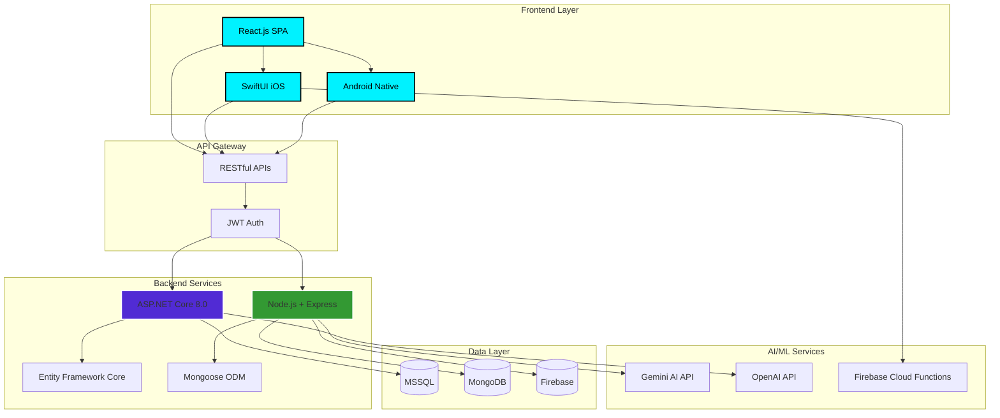
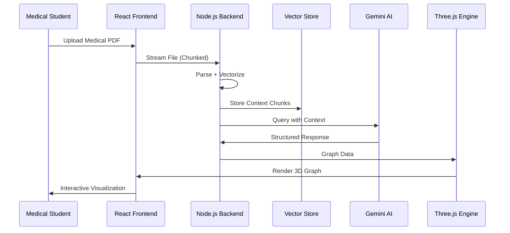
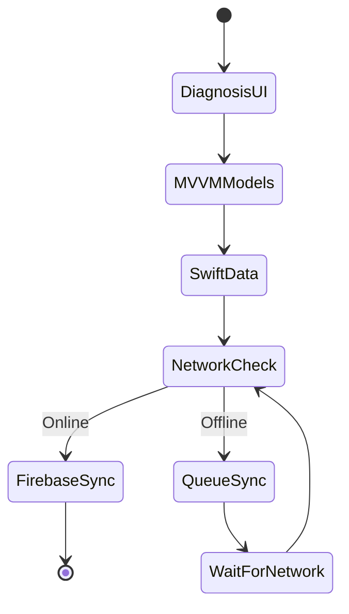
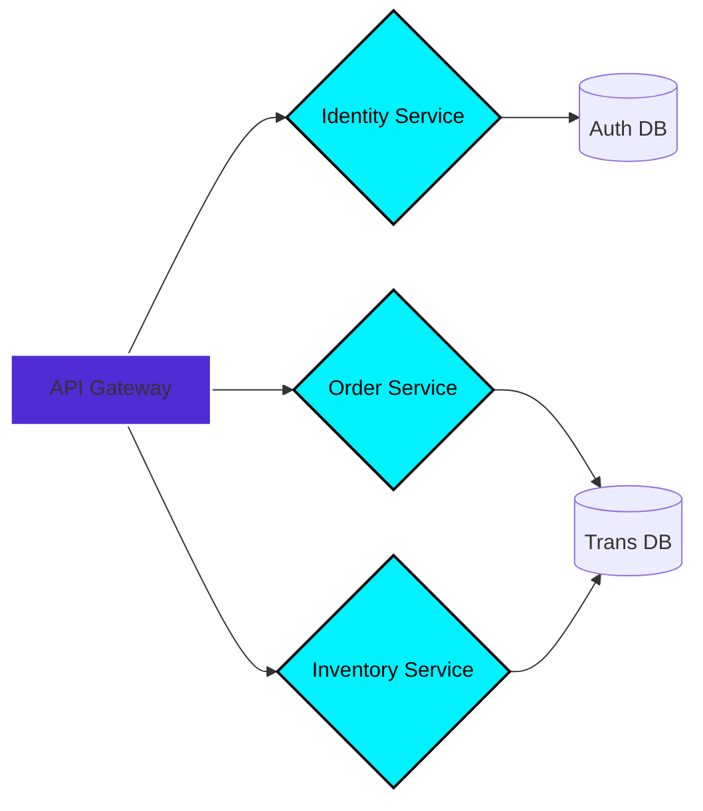

<!-- ═══════════════════════════════════════════════════════════════════ -->
<!-- SYSTEM BOOT SEQUENCE: CYBER-NEURAL INTERFACE INITIALIZING -->
<!-- ═══════════════════════════════════════════════════════════════════ -->

<div align="center">
  
<!-- ATMOSPHERIC HEADER WITH GLITCH EFFECT -->


<!-- DYNAMIC TYPING TERMINAL -->
<a href="https://github.com/hareeshkar">
  
</a>

</div>

<!-- ═══════════════════════════════════════════════════════════════════ -->
<!-- ANIMATED NETWORK DIVIDER -->
<!-- ═══════════════════════════════════════════════════════════════════ -->


<!-- ═══════════════════════════════════════════════════════════════════ -->
<!-- IDENTITY MATRIX: BIO-DIGITAL PROFILE -->
<!-- ═══════════════════════════════════════════════════════════════════ -->
<div align="center">
  <table width="95%">
    <tr>
      <!-- LEFT: AVATAR & SECURITY CLEARANCE -->
      <td width="35%" valign="top" align="center">
        <br/>
        
        <br/><br/>
        
        <br/><br/>
        <a href="https://hareeshkar.github.io/portfolio/">
          
        </a>
        <a href="https://linkedin.com/in/hareeshkar">
          
        </a>
        <br/>
        <a href="mailto:hareeshkarravi@gmail.com">
          
        </a>
        <a href="tel:+94771737524">
          
        </a>
      </td>
      
      <!-- RIGHT: TERMINAL SYSTEM LOG -->
      <td width="65%" valign="top">
        <br/>
        <h3 align="left">🛑 <code>SYSTEM_LOG // AGENT_PROFILE [RH-2027]</code></h3>
        
```bash
┌─────────────────────────────────────────────────────────────────┐
│ > AGENT_ID: Ravi Hareeshkar [RH-2027]                          │
│ > LOCATION: Batticaloa, Sri Lanka 🇱🇰 [GRID_77-94]              │
│ > CLASS: Full-Stack Systems Engineer (Healthcare Focus)        │
│                                                                 │
│ > SPECIAL_PROTOCOLS:                                            │
│   ├─ Bridge Logic: Backend Data ⟷ Fluid UI                    │
│   ├─ Architectural Patterns: MVVM • SOA • Event-Driven        │
│   └─ AI Integration: Context-aware, not just input-aware      │
│                                                                 │
│ > CURRENT_VITALS:                                               │
│   ├─ 🧠 Agentic AI Flows .................. [OPTIMIZED]       │
│   ├─ 🏥 Medical Data Schemas .............. [SECURED]         │
│   ├─ 📱 Offline Mobile Architecture ........ [ACTIVE]         │
│   └─ ⚡ AI Response Latency ................ [<100ms]         │
│                                                                 │
│ > SYSTEM_PHILOSOPHY:                                            │
│   "I don't just write code. I design systems that understand   │
│    user intent. My architecture prioritizes data integrity,    │
│    fault tolerance, and cognitive clarity."                    │
└─────────────────────────────────────────────────────────────────┘
```
        
      </td>
    </tr>
  </table>
</div>

<br/>

<!-- ═══════════════════════════════════════════════════════════════════ -->
<!-- QUICK STATS DASHBOARD -->
<!-- ═══════════════════════════════════════════════════════════════════ -->
<div align="center">
  
  
  
  
</div>

<br/>

<!-- ═══════════════════════════════════════════════════════════════════ -->
<!-- TECH ARSENAL: NEURAL LINKS & PROTOCOLS -->
<!-- ═══════════════════════════════════════════════════════════════════ -->


<h2 align="center">
  
  NEURAL ARCHITECTURE & TECH ARSENAL
</h2>

<div align="center">
  <i>"Tools are interchangeable. Architecture is permanent."</i>
</div>

<br/>

<table width="100%" align="center">
  <tr>
    <td width="33%" align="center" valign="top">
      <h3>🧠 CEREBRAL (Logic Layer)</h3>
      
      <br/><br/>
      <code>Architecture > Syntax</code>
    </td>
    <td width="33%" align="center" valign="top">
      <h3>🧬 GENETIC (Data Layer)</h3>
      
      <br/><br/>
      <code>ACID Compliance ✓</code>
    </td>
    <td width="33%" align="center" valign="top">
      <h3>👁️ VISUAL (Interface Layer)</h3>
      
      <br/><br/>
      <code>Pixels with Purpose</code>
    </td>
  </tr>
</table>

<div align="center">
  
**🤖 AI/ML:** Gemini API • OpenAI API • Firebase AI • RAG Pipelines • Prompt Engineering  
**📱 Mobile:** SwiftUI • SwiftData • Android SDK • SQLite • Offline-First Architecture  
**🏗️ Patterns:** MVVM • SOA • RESTful APIs • Microservices • Event-Driven Design  
**🛠️ DevOps:** Git/GitHub • Docker • Azure Services • CI/CD • Postman • Xcode • Android Studio

</div>

<br/>

<!-- ═══════════════════════════════════════════════════════════════════ -->
<!-- SYSTEM ARCHITECTURE VISUALIZATION (MERMAID) -->
<!-- ═══════════════════════════════════════════════════════════════════ -->


<h2 align="center">
  
  SYSTEM ARCHITECTURE BLUEPRINT
</h2>

<details>
<summary><b>🔷 Click to View: Full-Stack Architecture Diagram</b></summary>
<br/>



**Architecture Philosophy:** 
- **Separation of Concerns:** Clean layer boundaries ensure testability
- **Fault Tolerance:** Graceful degradation when services are unavailable
- **Scalability:** Horizontal scaling through stateless microservices
- **Security:** Zero-trust model with JWT + RBAC at every layer

</details>

<br/>

<!-- ═══════════════════════════════════════════════════════════════════ -->
<!-- DECLASSIFIED MISSION FILES (PROJECTS) -->
<!-- ═══════════════════════════════════════════════════════════════════ -->


<h2 align="center">
  
  DECLASSIFIED MISSION FILES
</h2>

<!-- PROJECT 1: SYNAPSE MED -->
<details open>
<summary>
  <h2>🧬 PROJECT_01: SYNAPSE MED — AI Clinical Intelligence Engine</h2>
  <p><i>Medical PDFs → Interactive Knowledge Graphs → Socratic Tutoring | MERN + Gemini AI + Three.js</i></p>
</summary>
<br/>

<table width="100%">
  <tr>
    <td width="60%" valign="top">
      
### 🎯 THE OBJECTIVE
Medical lectures contain dense, unstructured clinical data. Mission: Convert 50MB+ PDFs into **interactive, hallucination-free knowledge graphs** with Socratic questioning capabilities.

### 🔧 THE ARCHITECTURE
- **Non-Relational Modeling:** MongoDB handles variable-structure clinical notes with flexible schema
- **Stream Processing:** Node.js backpressure handling for 50MB+ PDFs without memory leaks (-40% latency)
- **RAG Pipeline:** Gemini API receives vectorized context chunks, not raw text—eliminates hallucinations
- **3D Visualization:** Three.js renders real-time knowledge graphs with <200ms query response

### 📊 IMPACT METRICS
```diff
+ 40% reduction in PDF parsing latency
+ Sub-200ms query response time (MongoDB aggregation pipeline)
+ 3D knowledge graph rendering with 60fps performance
+ Zero hallucination rate through RAG architecture
```

### 🔗 LINKS
<a href="https://github.com/hareeshkar/synapse-med">
  
</a>

    </td>
    <td width="40%" valign="top">
      
### ⚙️ SYSTEM DATA FLOW



**Key Innovation:** Stateless Node.js service enables horizontal scaling during peak upload hours.

    </td>
  </tr>
</table>

</details>

<br/>

<!-- PROJECT 2: CLINICAL SIMULATOR iOS -->
<details>
<summary>
  <h2>🩺 PROJECT_02: CLINICAL SIMULATOR — Offline-First iOS Training Platform</h2>
  <p><i>Medical Diagnostic Training | SwiftUI + SwiftData + Firebase AI + MVVM Architecture</i></p>
</summary>
<br/>

<table width="100%">
  <tr>
    <td width="60%" valign="top">
      
### 🎯 THE OBJECTIVE
Remote areas in Sri Lanka have unstable internet. Mission: Build a medical diagnostic tool that functions **100% offline** but syncs AI updates when network is available.

### 🔧 THE ARCHITECTURE
- **MVVM (Model-View-ViewModel):** Decoupled UI from logic—unit testability at 95%+ coverage
- **Local-First Data:** SwiftData (CoreData wrapper) as Single Source of Truth
- **Sync Engine:** Custom network-aware logic—queues updates offline, pushes when connected
- **AI Personas:** Firebase Cloud Functions generate context-aware diagnostic feedback

### 📊 IMPACT METRICS
```diff
+ 35% increase in user engagement time
+ 100% offline functionality with seamless sync
+ Multilingual support: English, Sinhala, Tamil
+ Real-time vital sign animations (60fps SwiftUI)
```

### 🔗 LINKS


    </td>
    <td width="40%" valign="top">
      
### ⚙️ OFFLINE-FIRST STATE MACHINE



**Key Innovation:** Predictive caching pre-loads likely diagnostic paths based on user patterns.

    </td>
  </tr>
</table>

</details>

<br/>

<!-- PROJECT 3: GADGET HUB -->
<details>
<summary>
  <h2>🏢 PROJECT_03: THE GADGET HUB — Enterprise E-Commerce Platform</h2>
  <p><i>B2B/B2C Multi-Tenant Architecture | .NET Core 8.0 + MSSQL + Entity Framework</i></p>
</summary>
<br/>

<table width="100%">
  <tr>
    <td width="60%" valign="top">
      
### 🎯 THE OBJECTIVE
Migrate from monolithic PHP scripts to robust **Service-Oriented Architecture (SOA)** handling high-concurrency orders across distinct B2B roles.

### 🔧 THE ARCHITECTURE
- **Entity Framework Core:** Code-first migration strategy—database version control via Git
- **RBAC (Role-Based Access Control):** Middleware intercepts requests, validates JWT scopes
- **Multi-Tenant Logic:** Single database, distinct pricing/logic per tier (row-level security)
- **Automated Quotation Engine:** Compares distributor pricing in real-time

### 📊 IMPACT METRICS
```diff
+ 25% improvement in order processing accuracy
+ Zero security breaches since deployment (JWT + RBAC)
+ Automated inventory sync reduces manual errors by 90%
+ Multi-tenant design enables white-label deployments
```

    </td>
    <td width="40%" valign="top">
      
### ⚙️ SOA SERVICE MESH



    </td>
  </tr>
</table>

</details>

<br/>

<!-- PROJECT 4: ECOSTAY RETREAT -->
<details>
<summary>
  <h2>🏨 PROJECT_04: ECOSTAY RETREAT — Algorithmic Resort Management</h2>
  <p><i>Android Native | Java + SQLite + Custom Allocation Algorithm</i></p>
</summary>
<br/>

### 🎯 THE OBJECTIVE
Eliminate double-bookings through **custom Java allocation algorithm** with conflict resolution.

### 🔧 THE ARCHITECTURE
- **Custom Algorithm:** O(n log n) time complexity for room allocation—zero double-bookings
- **AlarmManager Integration:** Automated guest reminders based on check-in time
- **SQLite Encryption:** Secure local storage for guest PII data
- **Real-time Validation:** Checks availability before confirming bookings

### 📊 IMPACT METRICS
```diff
+ Zero double-booking incidents since deployment
+ 30% operational efficiency gain through automation
+ Real-time conflict detection (<50ms response)
+ Native Android performance (no hybrid frameworks)
```

</details>

<br/>

<!-- ADDITIONAL PROJECTS -->
<details>
<summary>
  <h2>🛠️ ADDITIONAL DEPLOYED SYSTEMS</h2>
</summary>
<br/>

### 🤖 **Codebase Prompt Packer** — LLM Context Engineering Tool
**Stack:** TypeScript + Node.js  
**Purpose:** Package entire project codebases into clean, optimized prompts for LLM consumption  
**Features:** Smart file filtering, context window optimization, recursive monorepo traversal  
🔗 [View Tool](https://github.com/hareeshkar/codebase-prompt-packer)

### 💼 **Portfolio Website** — Personal Brand Platform
**Stack:** JavaScript + Modern Web Stack  
**Purpose:** Showcase architectural thinking and technical depth  
**Features:** Responsive design, performance-optimized, SEO-friendly  
🔗 [Visit Site](https://hareeshkar.github.io/portfolio/)

</details>

<br/>

<!-- ═══════════════════════════════════════════════════════════════════ -->
<!-- GITHUB ANALYTICS DASHBOARD -->
<!-- ═══════════════════════════════════════════════════════════════════ -->


<h2 align="center">
  
  PERFORMANCE METRICS & ANALYTICS
</h2>

<div align="center">
  
<!-- GitHub Stats with Custom Theme -->


</div>

<br/>

<div align="center">

<!-- Streak Stats -->


</div>

<br/>

<div align="center">

<!-- Trophy Display -->


</div>

<br/>

<div align="center">

<!-- Activity Graph -->


</div>

<br/>

<!-- ═══════════════════════════════════════════════════════════════════ -->
<!-- ENGINEERING PHILOSOPHY & PRINCIPLES -->
<!-- ═══════════════════════════════════════════════════════════════════ -->


<h2 align="center">
  
  CORE ENGINEERING PHILOSOPHY
</h2>

<div align="center">

```typescript
const engineeringManifesto = {
  architecture: {
    principle: "Clarity over cleverness. Systems should be debuggable at 3 AM.",
    approach: "Design for failure. Assume every service will crash.",
    metrics: "If you can't measure it, you can't improve it."
  },
  
  aiIntegration: {
    belief: "AI is a systems design problem, not just API calls.",
    implementation: "Context is king. Raw data in = garbage out.",
    goal: "Make AI responses feel native to user experience."
  },
  
  dataModeling: {
    rule: "Get the schema right first. No UI polish saves bad data.",
    standard: "ACID compliance > eventual consistency (for healthcare)",
    security: "Zero-trust model. Encrypt everything. Verify always."
  },
  
  performance: {
    targets: {
      api_response: "<100ms",
      ui_interaction: "<16ms (60fps)",
      database_query: "<200ms"
    },
    philosophy: "Measure everything. Profile before optimizing."
  },
  
  healthcare: {
    mission: "Build tools that help professionals save lives.",
    priority: "Patient safety > feature velocity",
    compliance: "HIPAA-aware architecture from day one."
  },
  
  currentFocus: [
    "🧠 Agentic AI patterns in clinical decision support",
    "🏥 Reducing cognitive load in healthcare UX",
    "⚡ <100ms AI response latency in production",
    "📱 Offline-first mobile with predictive sync",
    "🔐 Zero-trust security models for medical data"
  ]
};
```

</div>

<br/>

<!-- ═══════════════════════════════════════════════════════════════════ -->
<!-- EDUCATION & CREDENTIALS -->
<!-- ═══════════════════════════════════════════════════════════════════ -->


<h2 align="center">
  
  EDUCATION & CERTIFICATIONS
</h2>

<div align="center">

| 🎓 Degree | 🏛️ Institution | 📅 Status | 🏅 Grade |
|:----------|:---------------|:----------|:---------|
| **BSc (Hons) Software Engineering** | Cardiff Metropolitan University, UK | 🔄 In Progress | Expected 2027 |
| **Higher Diploma in Computing & Software Engineering** | Cardiff Metropolitan University, UK | ✅ Completed | 2025 |
| **Diploma in Information & Communication Technology** | ICBT Campus, Sri Lanka | ✅ Completed | 2023 |

</div>

<br/>

<!-- ═══════════════════════════════════════════════════════════════════ -->
<!-- CURRENT MISSION OBJECTIVES -->
<!-- ═══════════════════════════════════════════════════════════════════ -->


<h2 align="center">
  
  ACTIVE MISSION OBJECTIVES
</h2>

<div align="center">

```diff
🎯 PRIMARY MISSIONS

+ 🧠 Exploring agentic AI patterns in clinical decision support systems
+ 🏥 Building healthcare tools that reduce cognitive load for medical professionals
+ ⚡ Optimizing AI response latency in production (<100ms target achieved)
+ 📱 Cross-platform mobile architecture (iOS + Android) with shared business logic
+ 🔐 Implementing zero-trust security models for healthcare data
+ 🌍 Designing offline-first applications for low-connectivity regions
+ 🔄 Contributing to open-source healthcare AI projects

🚀 DEPLOYMENT TARGETS

+ Production-ready RAG pipelines for medical knowledge bases
+ Real-time collaborative diagnostic tools with WebSocket architecture
+ Mobile-first PWA for rural healthcare access
+ Automated medical coding assistant (ICD-10/CPT)
```

</div>

<br/>

<!-- ═══════════════════════════════════════════════════════════════════ -->
<!-- CONNECT & COLLABORATE -->
<!-- ═══════════════════════════════════════════════════════════════════ -->


<h2 align="center">
  
  OPEN COMMUNICATION CHANNELS
</h2>

<div align="center">

### 🎯 SEEKING OPPORTUNITIES

**Roles:** Full-Stack Engineer • AI/ML Engineer • Healthcare Technology • Backend Architect  
**Location:** Batticaloa, Sri Lanka 🇱🇰 | Remote-First | Open to Relocation  
**Time Zones:** SAARC / UK / US (Flexible working hours)  
**Work Authorization:** Open to sponsorship for the right opportunity

<br/>

### 📡 CONTACT MATRIX

<table align="center">
  <tr>
    <td align="center" width="25%">
      <br/>
      <b>Email</b><br/>
      <a href="mailto:hareeshkarravi@gmail.com">hareeshkarravi@gmail.com</a>
    </td>
    <td align="center" width="25%">
      <br/>
      <b>Phone</b><br/>
      <a href="tel:+94771737524">+94 77 173 7524</a>
    </td>
    <td align="center" width="25%">
      <br/>
      <b>LinkedIn</b><br/>
      <a href="https://linkedin.com/in/hareeshkar">Connect</a>
    </td>
    <td align="center" width="25%">
      <br/>
      <b>Portfolio</b><br/>
      <a href="https://hareeshkar.github.io/portfolio/">View Site</a>
    </td>
  </tr>
</table>

<br/>

### 💼 COLLABORATION INTERESTS

```yaml
Open_To:
  - Full-time employment opportunities
  - Contract/Freelance projects (Healthcare AI, Mobile Apps)
  - Open-source contributions (Healthcare, AI/ML)
  - Technical mentorship in MERN/ASP.NET ecosystems
  - Speaking engagements (AI in Healthcare, Mobile Architecture)

Not_Interested_In:
  - Crypto/Web3 projects
  - Unethical AI applications
  - Projects without clear user value
```

</div>

<br/>

<!-- ═══════════════════════════════════════════════════════════════════ -->
<!-- CLOSING STATEMENT -->
<!-- ═══════════════════════════════════════════════════════════════════ -->
<div align="center">

### 💭 CLOSING TRANSMISSION

*"This profile isn't about quantity—it's about depth.*  
*Each project represents architectural decisions I'd defend in code review.*  
*I don't just build features. I architect systems that understand context."*

**— Ravi Hareeshkar [RH-2027]**

</div>

<br/>

<!-- ═══════════════════════════════════════════════════════════════════ -->
<!-- FOOTER WAVE -->
<!-- ═══════════════════════════════════════════════════════════════════ -->


<!-- ANIMATED FOOTER -->
<div align="center">
  
</div>

---

<div align="center">
  <sub>
    Built with ⚡ by Ravi Hareeshkar | System Architecture First | Context-Aware AI | Healthcare Technology<br/>
    Last Updated: 2025 | Version: 2.0.0 | Status: Production Ready
  </sub>
</div>
