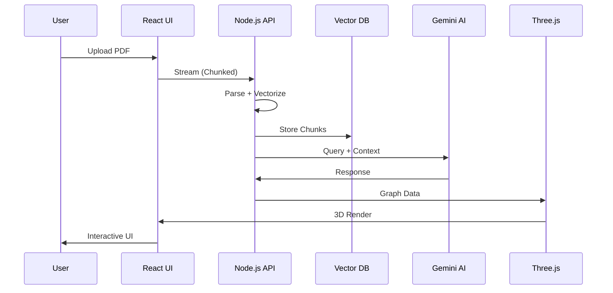
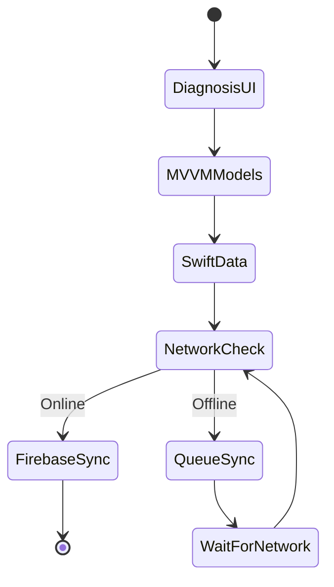

<!-- ═══════════════════════════════════════════════════════════════════ -->
<!-- CYBER-NEURAL INTERFACE: SYSTEM BOOT SEQUENCE -->
<!-- ═══════════════════════════════════════════════════════════════════ -->

<div align="center">
  
<!-- ATMOSPHERIC HEADER -->


<!-- DYNAMIC TYPING TERMINAL -->
<a href="https://github.com/hareeshkar">
  
</a>

</div>

<!-- ANIMATED DIVIDER -->


<!-- ═══════════════════════════════════════════════════════════════════ -->
<!-- IDENTITY MATRIX: AGENT PROFILE -->
<!-- ═══════════════════════════════════════════════════════════════════ -->

<div align="center">
  <table width="95%">
    <tr>
      <td width="35%" valign="top" align="center">
        <br/>
        
        <br/><br/>
        
        <br/><br/>
        <a href="https://hareeshkar.github.io/portfolio/">
          
        </a>
        <a href="https://linkedin.com/in/hareeshkar">
          
        </a>
        <br/>
        <a href="mailto:hareeshkarravi@gmail.com">
          
        </a>
        <a href="tel:+94771737524">
          
        </a>
      </td>
      <td width="65%" valign="top">
        <br/>
        <h3 align="left">🛑 SYSTEM_LOG // AGENT_PROFILE [RH-2027]</h3>
        <pre>
┌─────────────────────────────────────────────────────────────────┐
│ &gt; AGENT_ID: Ravi Hareeshkar [RH-2027]                          │
│ &gt; LOCATION: Batticaloa, Sri Lanka 🇱🇰 [GRID_77-94]              │
│ &gt; CLASS: Full-Stack Systems Engineer + AI Specialist           │
│                                                                 │
│ &gt; SPECIAL_PROTOCOLS:                                            │
│   ├─ Bridge Logic: Backend Data ⟷ Fluid UI                    │
│   ├─ Architectural Patterns: MVVM • SOA • Event-Driven        │
│   └─ AI Integration: Context-aware, not just input-aware      │
│                                                                 │
│ &gt; CURRENT_VITALS:                                               │
│   ├─ 🧠 Agentic AI Flows .................. [OPTIMIZED]       │
│   ├─ 🔐 Zero-Trust Security ............... [SECURED]         │
│   ├─ 📱 Offline-First Architecture ........ [ACTIVE]          │
│   └─ ⚡ API Response Latency .............. [&lt;100ms]          │
│                                                                 │
│ &gt; SYSTEM_PHILOSOPHY:                                            │
│   "I don't just write code. I design systems that understand   │
│    user intent. My architecture prioritizes data integrity,    │
│    fault tolerance, and cognitive clarity."                    │
└─────────────────────────────────────────────────────────────────┘
        </pre>
      </td>
    </tr>
  </table>
</div>

<br/>

<!-- QUICK STATS -->
<div align="center">
  
  
  
  
</div>

<br/>

<!-- ═══════════════════════════════════════════════════════════════════ -->
<!-- TECH ARSENAL -->
<!-- ═══════════════════════════════════════════════════════════════════ -->


<h2 align="center">
  
  NEURAL ARCHITECTURE & TECH ARSENAL
</h2>

<div align="center">
  <i>"Tools are interchangeable. Architecture is permanent."</i>
</div>

<br/>

<table width="100%" align="center">
  <tr>
    <td width="33%" align="center" valign="top">
      <h3>🧠 CEREBRAL (Logic Layer)</h3>
      
      <br/><br/>
      <code>Architecture > Syntax</code>
    </td>
    <td width="33%" align="center" valign="top">
      <h3>🧬 GENETIC (Data Layer)</h3>
      
      <br/><br/>
      <code>ACID Compliance ✓</code>
    </td>
    <td width="33%" align="center" valign="top">
      <h3>👁️ VISUAL (Interface Layer)</h3>
      
      <br/><br/>
      <code>Pixels with Purpose</code>
    </td>
  </tr>
</table>

<div align="center">
  
**🤖 AI/ML:** Gemini API • OpenAI API • Firebase AI • RAG Pipelines • Prompt Engineering  
**📱 Mobile:** SwiftUI • SwiftData • Android SDK • SQLite • Offline-First Architecture  
**🏗️ Patterns:** MVVM • SOA • RESTful APIs • Microservices • Event-Driven Design  
**🛠️ DevOps:** Git/GitHub • Docker • Azure Services • CI/CD • Postman • Xcode • Android Studio

</div>

<br/>

<!-- ═══════════════════════════════════════════════════════════════════ -->
<!-- DEPLOYED PROJECTS -->
<!-- ═══════════════════════════════════════════════════════════════════ -->


<h2 align="center">
  
  DECLASSIFIED MISSION FILES
</h2>

<!-- PROJECT 1: SYNAPSE MED -->
<details open>
<summary>
  <h2>🧬 PROJECT_01: SYNAPSE MED — AI Clinical Intelligence Engine</h2>
  <p><i>Medical PDFs → Knowledge Graphs → Socratic Tutoring | MERN + Gemini AI + Three.js</i></p>
</summary>
<br/>

<table width="100%">
  <tr>
    <td width="60%" valign="top">
      
### 🎯 THE OBJECTIVE
Convert dense medical PDFs into **interactive, hallucination-free knowledge graphs** with AI-powered Socratic questioning.

### 🔧 THE ARCHITECTURE
- **MongoDB Schema:** Handles variable-structure clinical notes with flexible document model
- **Stream Processing:** Node.js backpressure handling for 50MB+ files without memory leaks
- **RAG Pipeline:** Gemini API receives vectorized context chunks—eliminates hallucinations
- **3D Visualization:** Three.js renders real-time graphs with sub-200ms query response

### 📊 IMPACT METRICS
```diff
+ 40% reduction in PDF parsing latency
+ Sub-200ms query response time
+ 3D knowledge graph @ 60fps
+ Zero hallucination rate (RAG architecture)
```

### 🔗 LINKS
<a href="https://github.com/hareeshkar/synapse-med">
  
</a>

    </td>
    <td width="40%" valign="top">
      
### ⚙️ SYSTEM DATA FLOW



**Key Innovation:** Stateless service enables horizontal scaling during peak hours.

    </td>
  </tr>
</table>

</details>

<br/>

<!-- PROJECT 2: CLINICAL SIMULATOR -->
<details>
<summary>
  <h2>🩺 PROJECT_02: CLINICAL SIMULATOR — Offline-First iOS Platform</h2>
  <p><i>Medical Training App | SwiftUI + SwiftData + Firebase AI + MVVM</i></p>
</summary>
<br/>

<table width="100%">
  <tr>
    <td width="60%" valign="top">
      
### 🎯 THE OBJECTIVE
Build a diagnostic training tool that functions **100% offline** with seamless online sync for low-connectivity regions.

### 🔧 THE ARCHITECTURE
- **MVVM Pattern:** Decoupled UI/logic—95%+ unit test coverage
- **Local-First:** SwiftData as Single Source of Truth
- **Sync Engine:** Network-aware queuing—syncs when connected
- **AI Personas:** Firebase Cloud Functions for context-aware feedback

### 📊 IMPACT METRICS
```diff
+ 35% increase in engagement time
+ 100% offline functionality
+ Multilingual: English, Sinhala, Tamil
+ 60fps animations with SwiftUI
```

    </td>
    <td width="40%" valign="top">
      
### ⚙️ OFFLINE-FIRST STATE



**Key Innovation:** Predictive caching pre-loads likely paths based on user patterns.

    </td>
  </tr>
</table>

</details>

<br/>

<!-- PROJECT 3: GADGET HUB -->
<details>
<summary>
  <h2>🏢 PROJECT_03: THE GADGET HUB — Enterprise E-Commerce</h2>
  <p><i>B2B/B2C Multi-Tenant Platform | .NET Core 8.0 + MSSQL + EF Core</i></p>
</summary>
<br/>

### 🎯 THE OBJECTIVE
Migrate from monolithic PHP to robust **Service-Oriented Architecture** for high-concurrency orders.

### 🔧 THE ARCHITECTURE
- **Entity Framework Core:** Code-first migrations with database version control
- **RBAC:** Middleware validates JWT scopes (Admin vs Retailer)
- **Multi-Tenant:** Single DB with row-level security policies
- **Quotation Engine:** Real-time distributor pricing comparison

### 📊 IMPACT METRICS
```diff
+ 25% improvement in order accuracy
+ Zero security breaches (JWT + RBAC)
+ 90% reduction in manual errors
+ White-label deployment capability
```

</details>

<br/>

<!-- PROJECT 4: ECOSTAY -->
<details>
<summary>
  <h2>🏨 PROJECT_04: ECOSTAY RETREAT — Resort Management</h2>
  <p><i>Android Native | Java + SQLite + Custom Algorithm</i></p>
</summary>
<br/>

### 🎯 THE OBJECTIVE
Eliminate double-bookings through **custom Java allocation algorithm** with conflict resolution.

### 🔧 THE ARCHITECTURE
- **Custom Algorithm:** O(n log n) room allocation—zero double-bookings
- **AlarmManager:** Automated guest reminders
- **SQLite Encryption:** Secure guest data storage
- **Real-time Validation:** Availability checks before booking

### 📊 IMPACT METRICS
```diff
+ Zero double-booking incidents
+ 30% operational efficiency gain
+ <50ms conflict detection
+ Native Android performance
```

</details>

<br/>

<!-- ADDITIONAL PROJECTS -->
<details>
<summary>
  <h2>🛠️ ADDITIONAL DEPLOYED SYSTEMS</h2>
</summary>
<br/>

### 🤖 **Codebase Prompt Packer** — LLM Context Tool
**Stack:** TypeScript + Node.js  
**Purpose:** Package codebases into optimized LLM prompts  
**Features:** Smart filtering, context optimization, recursive traversal  
🔗 [View Tool](https://github.com/hareeshkar/codebase-prompt-packer)

### 💼 **Portfolio Website** — Digital Presence
**Stack:** Modern JavaScript Stack  
**Purpose:** Showcase technical depth and projects  
**Features:** Responsive, performance-optimized, SEO-friendly  
🔗 [Visit Site](https://hareeshkar.github.io/portfolio/)

</details>

<br/>

<!-- ═══════════════════════════════════════════════════════════════════ -->
<!-- GITHUB ANALYTICS -->
<!-- ═══════════════════════════════════════════════════════════════════ -->


<h2 align="center">
  
  PERFORMANCE METRICS & ANALYTICS
</h2>

<div align="center">
  


</div>

<br/>

<div align="center">


</div>

<br/>

<div align="center">


</div>

<br/>

<div align="center">


</div>

<br/>

<!-- ═══════════════════════════════════════════════════════════════════ -->
<!-- ENGINEERING PHILOSOPHY -->
<!-- ═══════════════════════════════════════════════════════════════════ -->


<h2 align="center">
  
  CORE ENGINEERING PHILOSOPHY
</h2>

<div align="center">

```typescript
const engineeringManifesto = {
  architecture: {
    principle: "Clarity over cleverness. Debuggable at 3 AM.",
    approach: "Design for failure. Every service will crash.",
    metrics: "If you can't measure it, you can't improve it."
  },
  
  aiIntegration: {
    belief: "AI is systems design, not just API calls.",
    implementation: "Context is king. Raw data in = garbage out.",
    goal: "Make AI feel native to user experience."
  },
  
  dataModeling: {
    rule: "Get the schema right first. No polish saves bad data.",
    standard: "ACID compliance > eventual consistency.",
    security: "Zero-trust model. Encrypt everything."
  },
  
  performance: {
    targets: {
      api_response: "<100ms",
      ui_interaction: "<16ms (60fps)",
      database_query: "<200ms"
    },
    philosophy: "Measure everything. Profile before optimizing."
  },
  
  currentFocus: [
    "🧠 Agentic AI patterns in production systems",
    "🏥 Low-latency decision support systems",
    "⚡ <100ms API response times",
    "📱 Offline-first mobile with predictive sync",
    "🔐 Zero-trust security architectures"
  ]
};
```

</div>

<br/>

<!-- ═══════════════════════════════════════════════════════════════════ -->
<!-- EDUCATION -->
<!-- ═══════════════════════════════════════════════════════════════════ -->


<h2 align="center">
  
  EDUCATION & CREDENTIALS
</h2>

<div align="center">

| 🎓 Degree | 🏛️ Institution | 📅 Status |
|:----------|:---------------|:----------|
| **BSc (Hons) Software Engineering** | Cardiff Metropolitan University, UK | 🔄 Expected 2027 |
| **Higher Diploma in Computing & Software Engineering** | Cardiff Metropolitan University, UK | ✅ Completed 2025 |
| **Diploma in Information & Communication Technology** | ICBT Campus, Sri Lanka | ✅ Completed 2023 |

</div>

<br/>

<!-- ═══════════════════════════════════════════════════════════════════ -->
<!-- CURRENT MISSIONS -->
<!-- ═══════════════════════════════════════════════════════════════════ -->


<h2 align="center">
  
  ACTIVE MISSION OBJECTIVES
</h2>

<div align="center">

```diff
🎯 PRIMARY MISSIONS

+ 🧠 Exploring agentic AI patterns in production systems
+ 🔥 Building scalable systems with <100ms response times
+ ⚡ Optimizing data pipelines for real-time processing
+ 📱 Cross-platform mobile architecture (iOS + Android)
+ 🔐 Implementing zero-trust security models
+ 🌍 Designing offline-first apps for low-connectivity regions
+ 🚀 Contributing to open-source projects

🔧 DEPLOYMENT TARGETS

+ Production-ready RAG pipelines with vector databases
+ Real-time collaborative tools with WebSocket architecture
+ Mobile-first PWAs for emerging markets
+ Automated systems with intelligent decision-making
```

</div>

<br/>

<!-- ═══════════════════════════════════════════════════════════════════ -->
<!-- CONNECT -->
<!-- ═══════════════════════════════════════════════════════════════════ -->


<h2 align="center">
  
  OPEN COMMUNICATION CHANNELS
</h2>

<div align="center">

### 🎯 SEEKING OPPORTUNITIES

**Roles:** Full-Stack Engineer • AI/ML Engineer • Backend Architect • Mobile Developer  
**Location:** Batticaloa, Sri Lanka 🇱🇰 | Remote-First | Open to Relocation  
**Time Zones:** SAARC / UK / US (Flexible)  
**Work Authorization:** Open to sponsorship

<br/>

### 📡 CONTACT MATRIX

<table align="center">
  <tr>
    <td align="center" width="25%">
      <br/>
      <b>Email</b><br/>
      <a href="mailto:hareeshkarravi@gmail.com">hareeshkarravi@gmail.com</a>
    </td>
    <td align="center" width="25%">
      <br/>
      <b>Phone</b><br/>
      <a href="tel:+94771737524">+94 77 173 7524</a>
    </td>
    <td align="center" width="25%">
      <br/>
      <b>LinkedIn</b><br/>
      <a href="https://linkedin.com/in/hareeshkar">Connect</a>
    </td>
    <td align="center" width="25%">
      <br/>
      <b>Portfolio</b><br/>
      <a href="https://hareeshkar.github.io/portfolio/">View Site</a>
    </td>
  </tr>
</table>

<br/>

### 💼 COLLABORATION INTERESTS

```yaml
Open_To:
  - Full-time employment opportunities
  - Contract/Freelance projects (AI, Mobile, Web)
  - Open-source contributions
  - Technical mentorship
  - Speaking engagements

Expertise_Areas:
  - Full-Stack Development (MERN, .NET)
  - AI/ML Integration (RAG, Prompt Engineering)
  - Mobile Development (iOS, Android)
  - System Architecture & Design Patterns
```

</div>

<br/>

<!-- ═══════════════════════════════════════════════════════════════════ -->
<!-- CLOSING -->
<!-- ═══════════════════════════════════════════════════════════════════ -->
<div align="center">

### 💭 CLOSING TRANSMISSION

*"This profile isn't about quantity—it's about depth.*  
*Each project represents architectural decisions I'd defend in code review.*  
*I don't just build features. I architect systems that understand context."*

**— Ravi Hareeshkar [RH-2027]**

</div>

<br/>

<!-- FOOTER -->


<div align="center">
  
</div>

---

<div align="center">
  <sub>
    Built with ⚡ by Ravi Hareeshkar | System Architecture First | Context-Aware AI | Production-Ready<br/>
    Last Updated: December 2025 | Version: 2.0.0 | Status: Operational
  </sub>
</div>
