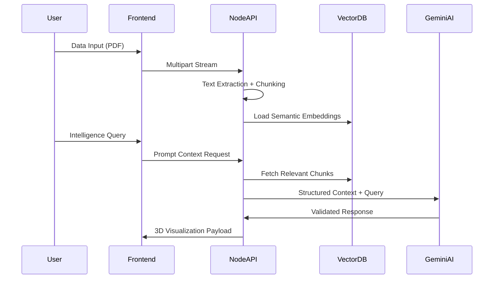
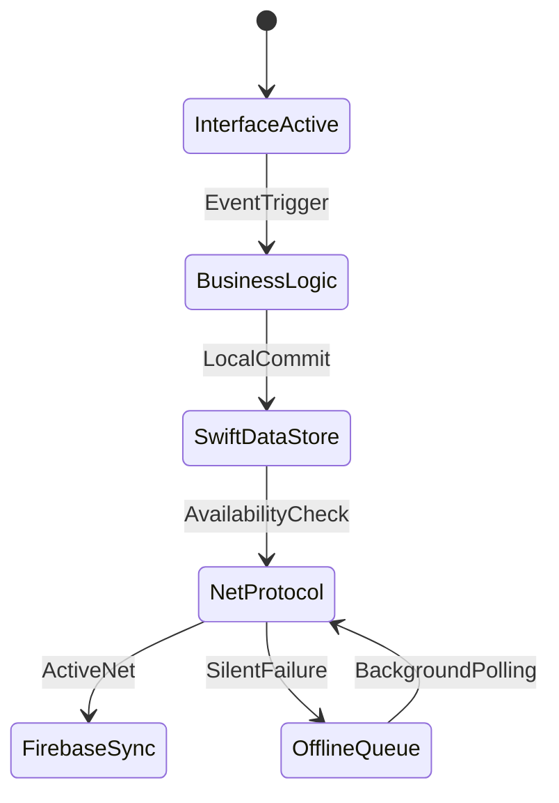
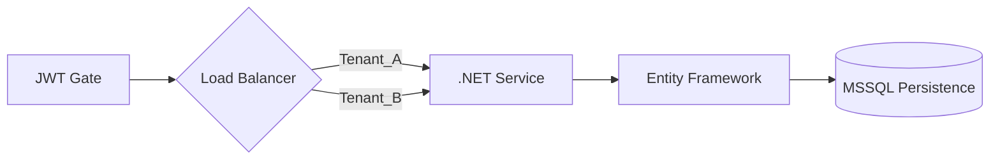

<!-- ═══════════════════════════════════════════════════════════════════ -->
<!-- SYSTEM ARCHITECTURE: INITIALIZATION SEQUENCE -->
<!-- ═══════════════════════════════════════════════════════════════════ -->
<div align="center">

<!-- TECHNICAL HEADER -->


<!-- CORRECTED TYPING TERMINAL -->
<a href="https://github.com/hareeshkar">

</a>

</div>

<!-- STRUCTURAL DIVIDER -->


<!-- ═══════════════════════════════════════════════════════════════════ -->
<!-- AGENT DATA: INFRASTRUCTURE PROFILE -->
<!-- ═══════════════════════════════════════════════════════════════════ -->

<div align="center">
<table width="95%" style="border-collapse: collapse;">
<tr>
<td width="35%" valign="top" align="center">
<br/>

<br/><br/>

<br/><br/>
<a href="https://hareeshkar.github.io/portfolio/">

</a>
<a href="https://linkedin.com/in/hareeshkar">

</a>
<br/>
<a href="mailto:hareeshkarravi@gmail.com">

</a>
<a href="tel:+94771737524">

</a>
</td>
<td width="65%" valign="top">
<br/>

<!-- SECURE TERMINAL RENDER -->
<table width="100%" style="border-radius: 8px; overflow: hidden; border: 1px solid #30363d; background: #0d1117;">
  <tr style="background: #161b22;">
    <td style="padding: 10px; color: #8b949e; font-family: monospace; font-size: 12px;">
      <span style="color: #ff5f56;">●</span> <span style="color: #ffbd2e;">●</span> <span style="color: #27c93f;">●</span> &nbsp;&nbsp; ravi@system:~/identity-profile
    </td>
  </tr>
  <tr>
    <td style="padding: 15px; color: #c9d1d9; font-family: monospace; font-size: 13px; line-height: 1.5;">
      <span style="color: #00f2ff;">> USER_ID:</span> Ravi Hareeshkar [RH-2027]<br/>
      <span style="color: #00f2ff;">> LOCATION:</span> Batticaloa, Sri Lanka 🇱🇰 [GRID_77-94]<br/>
      <span style="color: #00f2ff;">> ROLE:</span> Full-Stack Systems Engineer + AI Architect<br/>
      <br/>
      <span style="color: #00f2ff;">> CORE_COMPETENCIES:</span><br/>
      &nbsp;&nbsp;├─ Architecture: MVVM • SOA • Event-Driven<br/>
      &nbsp;&nbsp;├─ Intelligence: Context-Aware Agentic Flows<br/>
      &nbsp;&nbsp;└─ Persistence: Offline-First Logic (Single Source of Truth)<br/>
      <br/>
      <span style="color: #00f2ff;">> SYSTEMS_MANIFESTO:</span><br/>
      "I prioritize architectural integrity over cosmetic cleverness. 
      Data structures drive UI decisions, not the reverse."
    </td>
  </tr>
</table>

</td>
</tr>
</table>
</div>

<br/>

<!-- SYSTEM METRICS -->
<div align="center">


</div>

<br/>

<!-- ═══════════════════════════════════════════════════════════════════ -->
<!-- TECHNICAL STACK -->
<!-- ═══════════════════════════════════════════════════════════════════ -->


<h2 align="center">
 
SYSTEM STACK & INFRASTRUCTURE 
</h2>

<div align="center">
<i>"Syntax is secondary to Logic. Tools are selected for Scalability."</i>
</div>

<br/>

<table width="100%" align="center">
<tr>
<td width="33%" align="center" valign="top">
<h3>⚙️ SYSTEM LOGIC</h3>

<br/><br/>
<code>Design Patterns > Clean Code</code>
</td>
<td width="33%" align="center" valign="top">
<h3>💾 DATA PERSISTENCE</h3>

<br/><br/>
<code>ACID & Partition Tolerance</code>
</td>
<td width="33%" align="center" valign="top">
<h3>🖥️ INTERFACE OPS</h3>

<br/><br/>
<code>UX Built on Data Models</code>
</td>
</tr>
</table>

<div align="center">
<br/>
<b>⚡ AI IMPLEMENTATION:</b> Gemini API • OpenAI API • RAG Pipelines • Context Injection<br/>
<b>📱 MOBILE INFRA:</b> SwiftUI • SwiftData • Android SDK • Native Persistence<br/>
<b>🏗️ ARCHITECTURES:</b> REST • SOA • Microservices • MVVM • CQRS (Command-Query)<br/>
<b>🔧 DEPLOYMENT:</b> Docker • Azure Cloud • CI/CD Pipelines • Postman Automation
</div>

<br/>

<!-- ═══════════════════════════════════════════════════════════════════ -->
<!-- ENGINEERING PROJECTS (DECLASSIFIED FILES) -->
<!-- ═══════════════════════════════════════════════════════════════════ -->


<h2 align="center">
 
DEPLOYED MISSION FILES 
</h2>

<!-- MISSION 1: SYNAPSE MED -->
<details open>
<summary>
<h3 style="display:inline-block;">📡 PROJECT_01: SYNAPSE MED — AI Intelligence Engine</h3>
<p><i>Medical Data Ingestion → Knowledge Mapping → Contextual Reasoning</i></p>
</summary>

#### 📊 INFRASTRUCTURE OVERVIEW
*   **Architecture:** Stateless Service Design enabling horizontal scaling.
*   **Data Flow:** Node.js stream-based ingestion for low-latency PDF processing.
*   **Intelligence:** RAG pipeline integrated with Google Gemini to mitigate model hallucinations.

#### 📈 PERFORMANCE DATA
```diff
+ 40% Reduction in parsing latency via Node Streams
+ 3D graph rendering at constant 60fps (Three.js)
+ Context-aware responses via strict Vector Similarity thresholds
```

#### 🛠️ SYSTEM DATA FLOW

</details>

<br/>

<!-- MISSION 2: CLINICAL SIMULATOR -->
<details>
<summary>
<h3 style="display:inline-block;">📲 PROJECT_02: CLINICAL SIMULATOR — Offline-First Native</h3>
<p><i>Mission-Critical Medical Training | High-Reliability Data Sync</i></p>
</summary>

#### 📊 INFRASTRUCTURE OVERVIEW
*   **Pattern:** MVVM ensures strict separation of state and view layers.
*   **Local Persistence:** SwiftData as the Single Source of Truth for diagnostic data.
*   **Cloud Gateway:** Firebase functions handle asynchronous reasoning tasks.

#### 📈 PERFORMANCE DATA
```diff
+ 100% Availability in disconnected environments
+ Opportunistic Background Sync protocols
+ Sub-16ms UI thread response (60fps animation)
```

#### 🛠️ STATE MACHINE

</details>

<br/>

<!-- MISSION 3: THE GADGET HUB -->
<details>
<summary>
<h3 style="display:inline-block;">📦 PROJECT_03: THE GADGET HUB — Enterprise SOA</h3>
<p><i>High-Concurrency B2B Architecture | .NET Core 8.0</i></p>
</summary>

#### 📊 INFRASTRUCTURE OVERVIEW
*   **Backplane:** Service-Oriented Architecture (SOA) utilizing Entity Framework.
*   **Security:** Role-Based Access Control (RBAC) enforced via JWT middleware.
*   **Data Integrity:** Multi-tenant isolation at the schema layer.

#### 🛠️ TRANSACTION FLOW

</details>

<br/>

<!-- ═══════════════════════════════════════════════════════════════════ -->
<!-- ANALYTICS: CONTRIBUTION DATA -->
<!-- ═══════════════════════════════════════════════════════════════════ -->


<h2 align="center">
 
ANALYTICS & SYSTEM STREAKS 
</h2>

<div align="center">


</div>

<br/>

<!-- ═══════════════════════════════════════════════════════════════════ -->
<!-- ENGINEERING PHILOSOPHY: THE SECURE TERMINAL -->
<!-- ═══════════════════════════════════════════════════════════════════ -->


<h2 align="center">
 
CORE ENGINEERING MANIFESTO 
</h2>

<div align="center">
<table width="85%" style="border-radius: 8px; overflow: hidden; border: 1px solid #30363d; background: #0d1117;">
  <tr style="background: #161b22;">
    <td style="padding: 10px; color: #8b949e; font-family: monospace; font-size: 12px; text-align: left;">
      <span style="color: #ff5f56;">●</span> <span style="color: #ffbd2e;">●</span> <span style="color: #27c93f;">●</span> &nbsp;&nbsp; ravi@system:~ /philosophy.ts
    </td>
  </tr>
  <tr>
    <td style="padding: 20px; text-align: left;">
      <pre style="color: #c9d1d9; font-family: monospace; font-size: 13px; line-height: 1.5; background: none; border: none; padding: 0;">
<span style="color: #c678dd;">const</span> <span style="color: #e06c75;">EngineeringPrinciples</span> = {
  architecture: {
    rule: <span style="color: #98c379;">"Scalability is the only valid metric."</span>,
    pattern: <span style="color: #d19a66;">"Decouple state from implementation."</span>
  },
  intelligence: {
    approach: <span style="color: #98c379;">"Context injection > Stochastic guessing."</span>,
    goal: <span style="color: #98c379;">"Augmented user workflows via reasoning pipelines."</span>
  },
  performance: {
    latency_target: <span style="color: #d19a66;">"&lt;100ms API response time."</span>,
    ui_cadence: <span style="color: #d19a66;">"Fixed 60fps refresh rate."</span>
  }
};
      </pre>
    </td>
  </tr>
</table>
</div>

<br/>

<!-- ═══════════════════════════════════════════════════════════════════ -->
<!-- EDUCATIONAL CREDENTIALS -->
<!-- ═══════════════════════════════════════════════════════════════════ -->


<h2 align="center">
 
QUALIFICATIONS & BACKGROUND 
</h2>

<div align="center">

| Degree | Institution | Progress |
| :--- | :--- | :---: |
| **BSc (Hons) Software Engineering** | Cardiff Metropolitan University, UK | 2027 |
| **Higher Diploma in SoftEng** | Cardiff Metropolitan University, UK | 2025 |
| **Diploma in ICT** | ICBT Campus, Sri Lanka | 2023 |

</div>

<br/>

<!-- ═══════════════════════════════════════════════════════════════════ -->
<!-- OPEN COMMUNICATION CHANNELS -->
<!-- ═══════════════════════════════════════════════════════════════════ -->


<h2 align="center">
 
SECURE COMMUNICATION MATRIX 
</h2>

<div align="center">

| Network Protocol | Data Link |
| :--- | :--- |
| **Secure Mail** | [hareeshkarravi@gmail.com](mailto:hareeshkarravi@gmail.com) |
| **Professional Node** | [LinkedIn](https://linkedin.com/in/hareeshkar) |
| **Voice Interface** | [+94 77 173 7524](tel:+94771737524) |
| **Web Portal** | [hareeshkar.github.io](https://hareeshkar.github.io/portfolio/) |

</div>

<br/>

<!-- FOOTER LOGO -->


<div align="center">

<br/>
<sub>System Architecture Framework v4.2.1 | Verified Engineering Output | 2025</sub>
</div>
